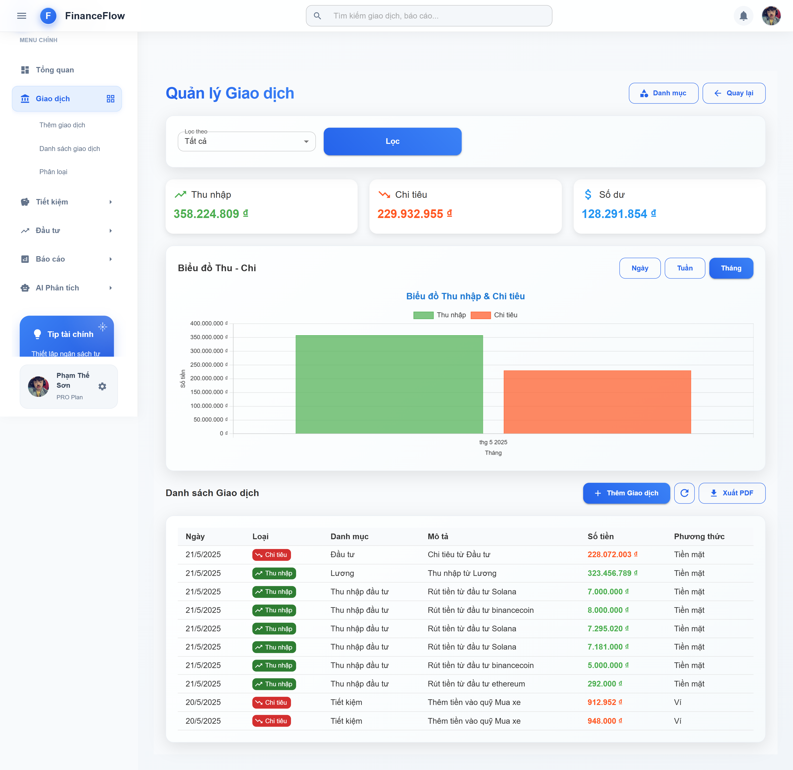
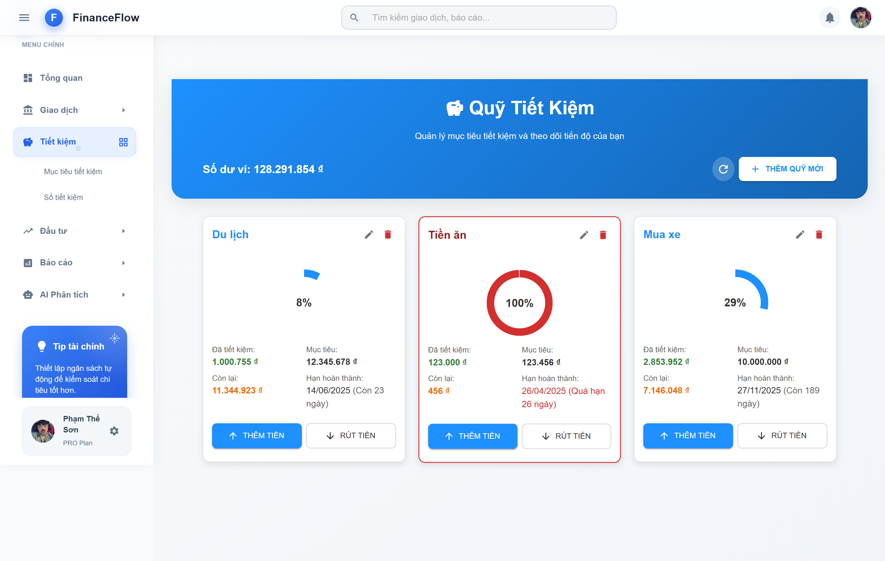
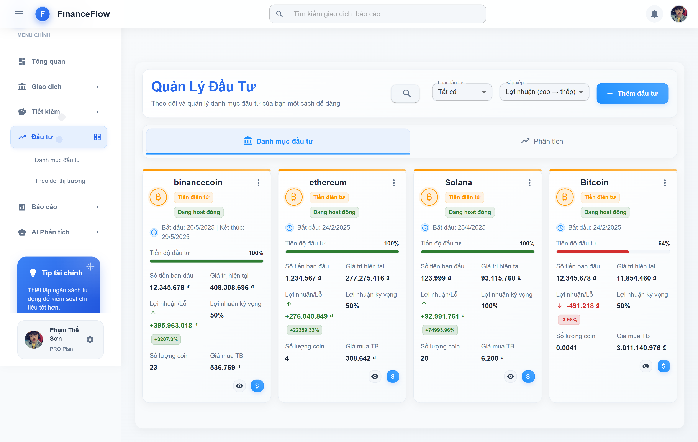
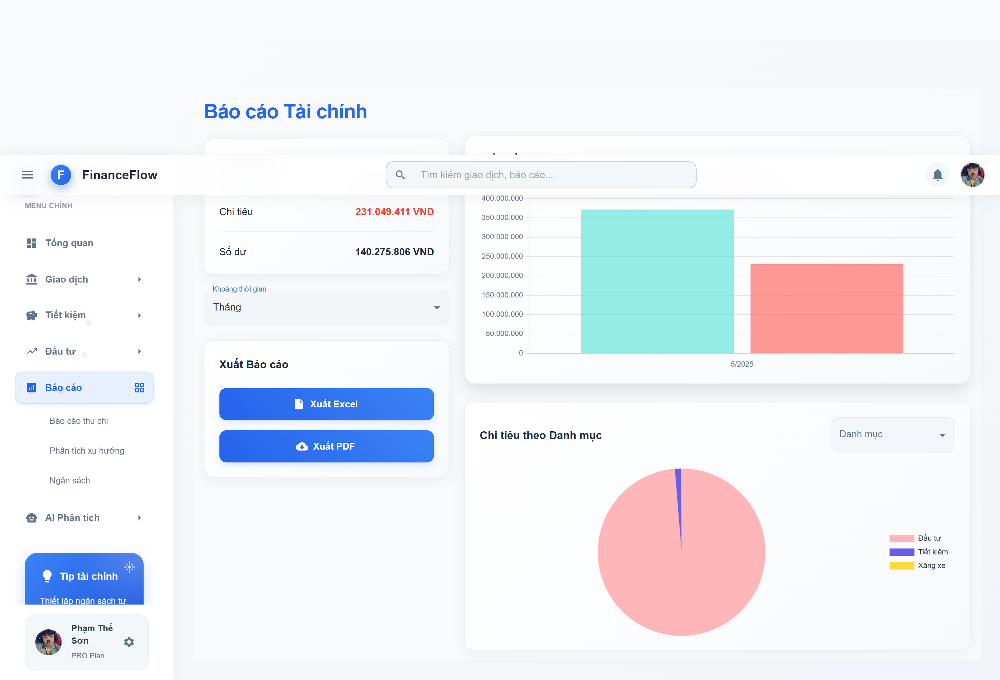

# 💰 Ứng dụng Quản lý Thu Chi Cá Nhân

Ứng dụng web giúp người dùng theo dõi thu nhập, chi tiêu, tạo báo cáo và lập kế hoạch tài chính cá nhân một cách **khoa học, trực quan và bảo mật**.

---

## 🧠 Tính năng nổi bật

- 👤 Đăng ký, đăng nhập, xác thực người dùng bằng JWT (HttpOnly cookie)
- ➕ Thêm, sửa, xoá các khoản thu nhập và chi tiêu
- 🏷️ Phân loại giao dịch theo danh mục (ăn uống, đi lại, giải trí, đầu tư, tiết kiệm…)
- 📈 Báo cáo tài chính trực quan bằng biểu đồ (Recharts / Chart.js)
- 📊 Thống kê theo ngày, tháng, năm, danh mục
- 🧾 Xuất báo cáo PDF, Excel
- 🌓 Chế độ sáng / tối (Dark / Light mode)
- 📧 Gửi email xác thực, OTP, và thông báo nhắc chi tiêu

---

## 🛠️ Công nghệ sử dụng

### 💻 Frontend (React + TypeScript)

| Công nghệ         | Mô tả                           |
|------------------|---------------------------------|
| ⚛️ React 18       | Thư viện giao diện              |
| 📘 TypeScript     | Ngôn ngữ có kiểm tra kiểu       |
| 🎨 MUI v5         | Giao diện Material Design       |
| 🔄 Redux Toolkit  | Quản lý trạng thái              |
| 📊 Recharts       | Vẽ biểu đồ thống kê             |
| 🌐 Axios          | Gọi API với interceptors        |
| 🎞️ Framer Motion | Animation mượt mà               |
| 🔐 JWT Cookie     | Quản lý phiên đăng nhập an toàn |

### 🖥️ Backend (Node.js + Express)

| Công nghệ         | Mô tả                               |
|------------------|-------------------------------------|
| 🚀 Node.js        | Môi trường chạy JavaScript backend |
| 🌐 Express.js     | Framework xây dựng REST API        |
| 🗄️ MongoDB        | Lưu trữ dữ liệu                     |
| 🔐 JWT + Cookies  | Xác thực an toàn, bảo mật cao      |
| 📧 Nodemailer     | Gửi email xác thực / OTP           |
| 🧾 ExcelJS, PDFKit| Xuất báo cáo PDF, Excel            |
| 🖼️ Multer         | Upload ảnh đại diện người dùng     |

---

## 🚀 Cài đặt và chạy ứng dụng

### 📦 Yêu cầu hệ thống

- Node.js >= 18.x
- npm
- MongoDB local hoặc MongoDB Atlas

---

### 📁 Clone project

```bash
git clone https://github.com/phamtheson2807/FinanceFlow.git
cd FinanceFlow
```

---

### 🖥️ Cài đặt và chạy Backend

```bash
cd server
npm install
cp .env.example .env
```

> 👉 Mở file `.env` và điền thông tin:
```
PORT=5000
MONGO_URI=mongodb://localhost:27017/financeflow
JWT_SECRET=your_jwt_secret
EMAIL_USER=your_email@gmail.com
EMAIL_PASS=your_email_password
CLIENT_URL=http://localhost:3000
```

```bash
npm run dev
```

> Server sẽ chạy tại: `http://localhost:5000`

---

### 💻 Cài đặt và chạy Frontend

```bash
cd client
npm install
npm run dev
```

> Ứng dụng frontend sẽ chạy tại: `http://localhost:3000`  
> Và tự động gọi API tới `http://localhost:5000/api`

---

## 📸 Giao diện Ứng dụng

### 🔐 Giao diện Đăng nhập & Đăng ký

| Đăng nhập | Đăng ký |
|-----------|---------|
|  |  |

---

### 🏠 Trang Tổng Quan


---

### 💸 Quản lý Giao dịch



---

### 💰 Quản lý Quỹ Tiết Kiệm



---

### 📈 Quản lý Đầu Tư



---

### 📊 Báo Cáo Tài Chính



---

### 🤖 AI Phân Tích & Tư vấn Tài chính


---

## 📄 Bản quyền

> ⚠️ Dự án này được phát triển là một đồ án tốt nghiệp và **chỉ được sử dụng cho mục đích học tập, nghiên cứu**.  
> ❌ Nghiêm cấm sử dụng cho mục đích thương mại khi chưa được sự cho phép của tác giả.

© 2025 [Phạm Thế Sơn](https://github.com/phamtheson2807)  
Dự án này được phát hành theo giấy phép [MIT License](LICENSE).

---

> Cảm ơn bạn đã sử dụng ứng dụng! Nếu thấy hữu ích hãy ⭐ project này để ủng hộ nhé 💖
